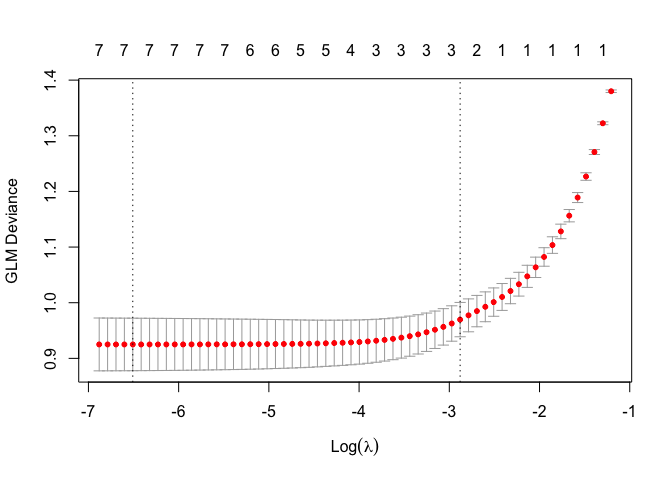

Assignment 5
================
Megan Marziali
Feb 10, 2021

## Part 1: Set-up

### Problem set-up

##### Loading required packages

The following code chunk loads the required packages for the assignment.

``` r
library(tidyverse) 
library(caret)
library(glmnet)

set.seed(100)
```

##### Loading data into environment and cleaning

``` r
alc_data = 
  read.csv("./data/alcohol_use.csv", na = c("", ".", "NA", ".d", ".r")) %>% 
  janitor::clean_names() %>%
  mutate(
    alc_consumption = as.factor(alc_consumption)
  ) %>% 
  select(-x)

summary(alc_data)
```

To clean the data, I stripped off the ID variable and recoded the
alcohol consumption variable as a factor. The complete dataset includes
1885 observations. No missing observations are present within the data.

##### Data partitioning

``` r
train.indices = createDataPartition(y = alc_data$alc_consumption,p = 0.7,list = FALSE)

training = alc_data[train.indices,]
testing = alc_data[-train.indices,]

#Store outcome 
alc_train = training$alc_consumption
alc_test = testing$alc_consumption

#Model.matrix shortcut to removing outcome variable from matrix
x_train = model.matrix(alc_consumption~., training)[,-1]
x_test = model.matrix(alc_consumption~., testing)[,-1]

# Convert the outcome (class) to a numerical variable for glmnet
alc_c = ifelse(training$alc_consumption == "CurrentUse", 1, 0)
```

## Problem 1

### 1.1: Choosing alpha and lambda via cross-validation

``` r
model.1 = train(
  alc_consumption ~., data = training, method = "glmnet",
  trControl = trainControl("cv", number = 10),
 tuneLength = 10
  )

param = model.1$bestTune

# Model coefficients
coef(model.1$finalModel, model.1$bestTune$lambda)
```

    ## 8 x 1 sparse Matrix of class "dgCMatrix"
    ##                                     1
    ## (Intercept)             -0.1360380730
    ## neurotocism_score        .           
    ## extroversion_score       .           
    ## openness_score           .           
    ## agreeableness_score      .           
    ## conscientiousness_score  .           
    ## impulsiveness_score     -0.4395500303
    ## sens_seeking_score      -0.0009963146

``` r
# Fitting model
model_1 = glmnet(x_train, alc_train, family = binomial, alpha = param$alpha, lambda = param$lambda)
coef(model_1)
```

    ## 8 x 1 sparse Matrix of class "dgCMatrix"
    ##                                    s0
    ## (Intercept)             -0.1360322012
    ## neurotocism_score        .           
    ## extroversion_score       .           
    ## openness_score           .           
    ## agreeableness_score      .           
    ## conscientiousness_score  .           
    ## impulsiveness_score     -0.4395131944
    ## sens_seeking_score      -0.0008956011

### 1.2: Model that uses logistic regression

``` r
model_2 = glm(alc_consumption ~ . ,family = binomial(link = 'logit'),data = training)
summary(model_2)
```

    ## 
    ## Call:
    ## glm(formula = alc_consumption ~ ., family = binomial(link = "logit"), 
    ##     data = training)
    ## 
    ## Deviance Residuals: 
    ##     Min       1Q   Median       3Q      Max  
    ## -1.9015  -0.7541  -0.2224   0.6597   3.4494  
    ## 
    ## Coefficients:
    ##                         Estimate Std. Error z value Pr(>|z|)    
    ## (Intercept)             -0.22334    0.07214  -3.096  0.00196 ** 
    ## neurotocism_score       -0.14892    0.08461  -1.760  0.07842 .  
    ## extroversion_score      -0.41965    0.09050  -4.637 3.53e-06 ***
    ## openness_score          -0.06617    0.08360  -0.791  0.42866    
    ## agreeableness_score     -0.08752    0.07951  -1.101  0.27101    
    ## conscientiousness_score  0.03249    0.08410   0.386  0.69930    
    ## impulsiveness_score     -1.77505    0.12512 -14.186  < 2e-16 ***
    ## sens_seeking_score      -0.22608    0.10152  -2.227  0.02595 *  
    ## ---
    ## Signif. codes:  0 '***' 0.001 '**' 0.01 '*' 0.05 '.' 0.1 ' ' 1
    ## 
    ## (Dispersion parameter for binomial family taken to be 1)
    ## 
    ##     Null deviance: 1824.3  on 1319  degrees of freedom
    ## Residual deviance: 1201.6  on 1312  degrees of freedom
    ## AIC: 1217.6
    ## 
    ## Number of Fisher Scoring iterations: 5

### 1.3: LASSO model using all features

``` r
model_3 = cv.glmnet(x_train, alc_train, alpha = 1, standardize = TRUE, family = binomial)

plot(model_3)
```

<!-- -->

``` r
model_3$lambda.min
```

    ## [1] 0.001490796

``` r
model_3$lambda.1se
```

    ## [1] 0.05612751

``` r
model_3_final = glmnet(x_train, alc_train, alpha = 1, lambda = model_3$lambda.1se, family = binomial)
coef(model_3_final)
```

    ## 8 x 1 sparse Matrix of class "dgCMatrix"
    ##                                  s0
    ## (Intercept)             -0.17559353
    ## neurotocism_score        .         
    ## extroversion_score      -0.04389756
    ## openness_score           .         
    ## agreeableness_score      .         
    ## conscientiousness_score  .         
    ## impulsiveness_score     -1.27339635
    ## sens_seeking_score      -0.06516229

## Part 2: Evaluating Model Performance

### 2.1: Alpha and lambda cross-validation model

``` r
fitted.results = predict(model_1, x_test, type = 'response') 
fitted.results.p = ifelse(fitted.results > 0.5,1,0)

testing.outcome = (as.numeric(testing$alc_consumption) - 1)

misClasificError = mean(fitted.results.p != testing.outcome, na.rm = T)
print(paste('Accuracy Model 1',1 - misClasificError))
```

    ## [1] "Accuracy Model 1 0.849557522123894"

The accuracy of model 1 is 0.85.

### 2.2: Evaluating logistic regression model

``` r
fitted.results.2 = predict(model_2, testing, type = 'response') 
fitted.results.p.2 = ifelse(fitted.results.2 > 0.5,1,0)

testing.outcome.2 = (as.numeric(testing$alc_consumption) - 1)

misClasificError.2 = mean(fitted.results.p.2 != testing.outcome.2, na.rm = T)
print(paste('Accuracy Model 2',1 - misClasificError.2))
```

    ## [1] "Accuracy Model 2 0.8"

The accuracy of model 2 is 0.80.

### 2.3: Evaluating LASSO model

``` r
fitted.results.3 = predict(model_3_final, x_test, type = 'response') 
fitted.results.p.3 = ifelse(fitted.results.3 > 0.5, 1, 0)

testing.outcome.3 = (as.numeric(testing$alc_consumption) - 1)

misClasificError.3 = mean(fitted.results.p.3 != testing.outcome.3, na.rm = T)
print(paste('Accuracy Model 3',1 - misClasificError.3))
```

    ## [1] "Accuracy Model 3 0.782300884955752"

The accuracy of model 3 is 0.78.
